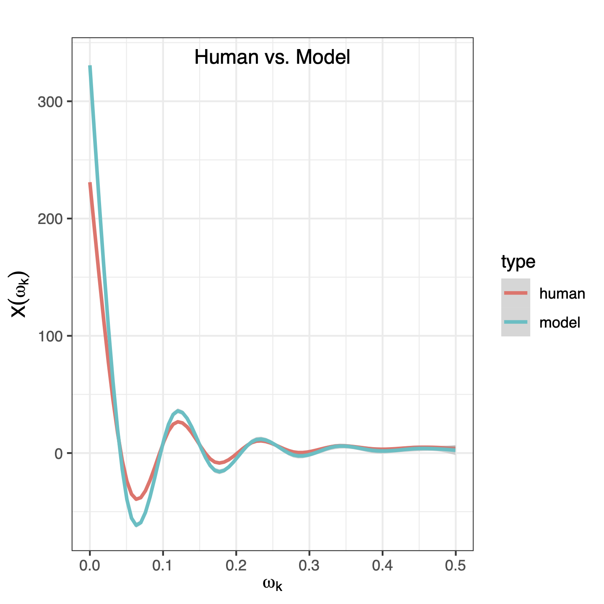

# FACE: Fourier Analysis of Cross-Entropy
Repository for the paper *FACE: Evaluating Natural Language Generation with
Fourier Analysis of Cross-Entropy* (NeurIPS 2023). 

```bibtex
@article{yang2023face,
  title={FACE: Evaluating Natural Language Generation with Fourier Analysis of Cross-Entropy},
  author={Yang, Zuhao and Yuan, Yingfang and Xu, Yang and Zhan, Shuo and Bai, Huajun and Chen, Kefan},
  journal={arXiv preprint arXiv:2305.10307},
  year={2023}
}
```

## Procedure for using FACE metric
1. Install the required packages in `requirements.txt`.
2. Run `data/gen_demo.py` to generate the demo data: `demo_human.txt` and `demo_model.txt`
```console
$ cd data
$ python gen_demo.py
```
3. Run `run_entropy.py` or `run_entropy_batch.py` to obtain the entropy sequences of the demo data, saved to `demo_human.nll.txt` and `demo_model.nll.txt`.
```console
$ python run_entropy.py --input data/demo_human.txt --output data/demo_human.nll.txt 
```
or
```console
$ python run_entropy_batch.py --input data/demo_human.txt --output data/demo_human.nll.txt --batch_size 8
```
4. Run `run_fft.py` to obtain the spectra of entropy, saved to `demo_human.fft.txt` and `demo_model.fft.txt`.
```console
$ python run_fft.py --input data/demo_human.nll.txt --output data/demo_human.fft.txt
```
The resulting .txt output file is a CSV-like 2-column file, where the first column is the frequency and the second column is the power of the spectrum, as shown below:
```console
freq,power
0.0,3151.3324000000002
0.000998003992015968,63.24569137707802
0.001996007984031936,8.73479577728772
...
```

5. Run `run_face.py` to compute the FACE scores, between `demo_human.fft.txt` and `demo_model.fft.txt`.
```console
python face.py --human data/demo_human.fft.txt --model data/demo_model.fft.txt --output data/demo_face.csv
```
If `--output` argument is not specified, then the summarized scores will be printed to stdout, as shown below:
```console
               SO        CORR         SAM       SPEAR
count  991.000000  993.000000  991.000000  991.000000
mean     0.363581    0.650132    0.266815    0.010954
std      0.068974    0.174052    0.071431    0.067517
min      0.137400    0.069470    0.144674   -0.279865
25%      0.315650    0.537658    0.207227   -0.026918
50%      0.384200    0.695188    0.254894    0.010032
75%      0.418000    0.794785    0.318524    0.050299
max      0.499800    0.898501    0.466583    0.376582
```

## Visualization
Run `plot/sample.R` to plot the aggregated and smoothed spectra in `demo_human.fft.txt` and `demo_model.fft.txt`, as shown below:

<!--  -->
